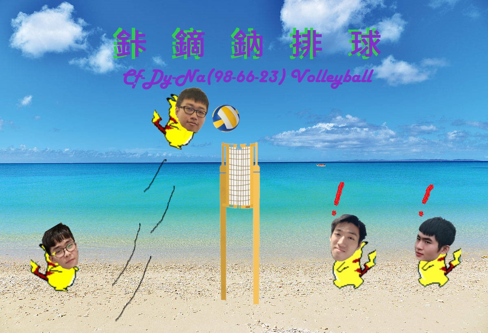
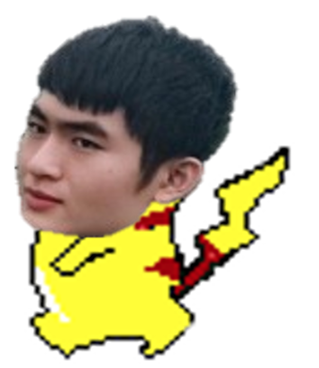
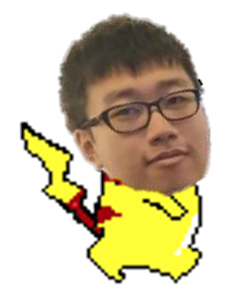

<html>
<head>
 <title>鉲鏑鈉排球</title>

 </head>

 <body bgcolor="Cyan" text="Snow" link="Black" vlink="Black" alink="Black">
<h1 style="color:DodgerBlue;>遊戲內容</h1>
 
 
 

 <h2 style="color:DodgerBlue;">
  <ul>
    <li style="color:DodgerBlue;">排球為主的遊戲</li>
    
   </ul>
   
   
 

  <ul>
    <li>以同學頭像為基礎的角色</li>
   </ul>
 
 

  
 
 

操作方法:
 
 

 [跳:5鍵 前進:1鍵 後退:3鍵 必殺技:2鍵](上圖) 
 
 
 

   
    
 

 操作方法:
  
 

 [跳:上箭頭 前進:左箭頭 後退:右箭頭 必殺技:下箭頭](上圖) 
 
 
 

   
    
 

 操作方法:
  
 

 [跳:I鍵 前進:J鍵 後退:L鍵 必殺技:K鍵](上圖) 
 
 
 

   
    
 

 操作方法:
  
 

 [跳:W鍵 前進:A鍵 後退:D鍵 必殺技:S鍵](上圖) 
 </h2>

</body>
</html>
